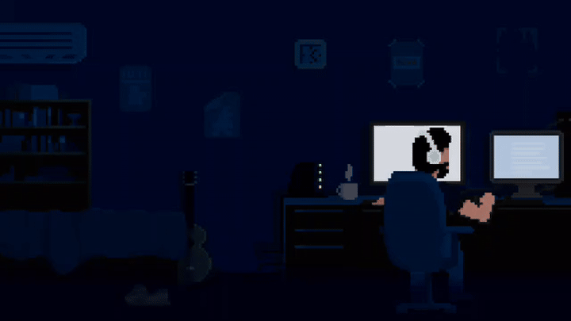

# Hi 👋! I'm YASHAS Y NAYAK

  

### An Information Science & Engineering student passionate about software development and Artificial Intelligence

🌱 Currently exploring **Backend Engineering, Full Stack Development and Artificial Intelligence**

💻 Building real-world applications and learning new technologies

🚀 Passionate about turning ideas into practical software solutions

### 🛠 Tech Stack

  
  
  
  
  
  
  
  
  
  
  
  
  
  
  
  
  
  
  
  
  

### 📈 GitHub Stats

### 🌐 Let's Connect!

  

  

  

